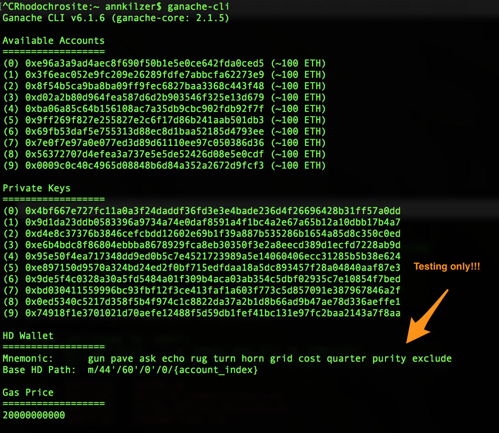
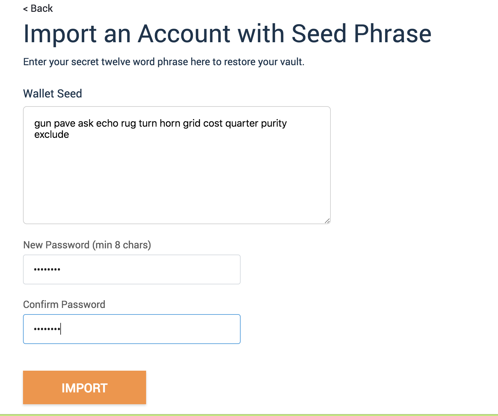
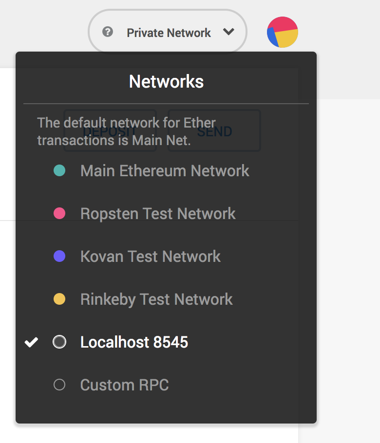

# meloncoin


Meloncoin is an expiring cryptocurrency backed by the famously expensive Hokkaido Melon.

Check out the [website](http://melonco.in), follow the project on [twitter](https://twitter.com/meloncointoken), or view the [ICO video.](https://www.youtube.com/watch?v=UpzojCZfz4Q)

Why melons? I live in Japan, and fruit is incredibly expensive here. It's not just for eating -- melons and other high-end fruits are given as gifts, and frequently carry price tags of upwards of $100USD and once [even reaching $27,000USD.](https://www.japantimes.co.jp/news/2016/05/26/business/hokkaido-melons-fetch-record-%C2%A53-million-seasons-first-auction/#.WL0HLBJ95PU)

While this fruit-based cryptocurrency is somewhat whimsical, the concept of an expiring token is generalizable. Consider concert tickets, video game pre-sales, or any item where the product peaks at a specific point in time. Value builds until that moment and no further.

When I researched expiring tokens, there wasn't much out there, aside from a [stack exchange thread](https://ethereum.stackexchange.com/questions/27379/is-it-possible-to-create-an-expiring-ephemeral-erc-20-token) and an [article from ConsenSys](https://medium.com/@ConsenSys/tokens-on-ethereum-e9e61dac9b4e) pointing to some [dead (expired?)](http://inflekt.us/) [links](http://farmshare.space/). Please send more my way if you find anything.


Prerequisites:

* [Truffle v4.1.11](https://truffleframework.com/truffle)
* [Solidity v0.4.24](https://github.com/ethereum/solidity)
* [Ganache v6.1.6.](https://truffleframework.com/ganache)
* [NPM 5.6.0](https://www.npmjs.com/)
* [Metamask](https://metamask.io/)

Runs on
Mac OS X High Sierra 10.13.6.

Ubuntu 16.04

**Setting up a local blockchain with ganache:**

In a terminal, run
```
ganache-cli
```

This starts up a local blockchain on port 8545, perfect for our demo.

Take note of the 12 word phrase and enter that into Metamask for the private net connection. (Important security note: never use reveal private keys or mnemonic for anything on the real net, this example is for test only!)



Now open a Chrome browser and set up metamask to recognize these accounts. Choose to import via a mnemonic, and copy that 12 word phrase:



Add a password.

Make sure Metamask is pointing to the test network:



**Deploying and running the Meloncoin app**

Open another terminal and run:

```
npm install
truffle compile && truffle migrate
npm run dev
```

Open up your browser at http://localhost:3000/ to see the app!

You can add the number of melons to mint and click submit to deploy a new Meloncoin contract starting now. The page will update to show the address of the newly launched Meloncoin contract. On a public net or testnet, you can import this address into any wallet manager that understands ERC20 (like Mist or Metamask) to interact with the tokens.

# User Stories

A farmer in Hokkaido predicts a good crop, and wants to invite investors to help sustain her farming operations. She creates a Meloncoin contract upon planting seeds, which is a promise to deliver a quality melon upon harvest.

An investor wishes to diversify from "eternal" assets like diamonds or gold, and desires something where value is tied to ephemerality. He invests in Meloncoin because it is backed by Japan's most exclusive fruit.

A Japanese salaryman desires to purchase a Yubari Melon as a seasonal gift for his boss, but he knows he can get a better rate by pre-ordering a Meloncoin rather than purchasing through a middleman fruit vendor.
